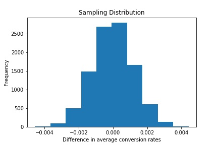
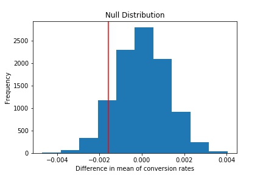

# Statistical Analysis of Web Page Traffic

# Table of Contents
1. Introduction
2. Prerequisites
3. File Description
4. Dataset Overview
5. Part I - Probability
6. Part II - A/B Test
7. Part III - Regression

# Introduction
- A company has developed a new web page in order to try and increase the number of users who "convert," meaning the number of users who decide to pay for the company's product.
- Through this project, my goal is to help the company understand if they should implement this new page, keep the old page, or perhaps run the experiment longer to make their decision.
- For this experiment, users are randomly given either the new page or old page thus dividing them into two groups- control and treatment.
- The control group receives the old version of page and the treatment group receives the new version.
Based on which group of users tend to buy the product more, the efficiency of the page will be determined and thus a decision will be made on which web page to choose as the final one.
- This project is divided into three parts:
  1. Probability
  2. A/B Tests
  3. Regression

# Prerequisites
1. Pandas (for data loading and analysis)
2. NumPy (for computing)
3. Matplotlib (for visualizations)
4. Seaborn (for visualizations)
5. Jupyter (to run notebooks)

# File Description
There are three folders:
1. Code
   - Statistical_Analysis.ipynb- covers the three parts of analyzing results of A/B testing and the documentation
2. Data
   - ab_data.csv: A/B Test Results Dataset
   - countries.csv: User's country residence information
3. Presentation
   - ab_data_presentation.slides.html: Slideshow providing insights on the results of A/B testing
   - presentation.gif - Preview of the presentation
   

# Dataset Overview

**ab_data.csv**
- The dataset include 294478 users
- There are 5 attributes namely:
   1. user_id: Unique Identification number for the user
   2. timestamp: Time the users visit the webpage
   3. group: The participants are divided into 2 groups: control and treatment
   4. landing_page: This states whether the user received new page or old page
   5. converted: 0 if the user did not convert and 1 if the user converted

**countries.csv**
- This dataset will be utilized for further analysis of whether the country variable will be useful addition to model
- There are 2 attributes namely:
   1. user_id: Unique Identification number for the user
   2. country: Country from where the user access the web page

# Part I - Probability
In this section, the question I have answered is:
**Is there is sufficient evidence to say that the new treatment page leads to more conversions?**

According to my results,
- The probability of an individual converting regardless of the page they receive is low (11.9%).
- The probability that a user lands on a new place is balanced (50%) so low number of samples in either group is not the reason
- Furthermore, the conversion rate of control group is more than the treatment group but the difference in the probability is not significant. - This small difference could also appear by chance, therefore we don't have sufficient evidence to conclude that the new treatment page leads to more conversions than the old page.
- The possible reasons for low conversion rate per group could be due to change aversion or novelty effect

**Thus, there is no sufficient evidence to say that the new treatment page leads to more conversions**

# Part II - A/B Test
Defining the Null and Alternative hypotheses, assuming that the old page is better unless the new page proves to be definitely better at a Type I error rate of 5%.
- **p_old** and **p_new** will be the converted rates for the old and new pages.

**Hypothesis**

1. **Null Hypothesis**: New Page is performing as good as or worse than the Old page i.e. New page will receive less or the same number of visitors compared to the Old page
2. **Alternate Hypothesis**: New Page is better than the Old page i.e New page will receive more visitors than the Old page

H_0: p_new - p_old <= 0

H_1: p_new - p_old > 0

To perform A/B testing I'll:
- Assume under the null hypothesis, p_new and p_old both have "true" success rates equal to the **converted** success rate regardless of page - that is p_new and p_old are equal. Furthermore, assume they are equal to the **converted** rate in **ab_data.csv** regardless of the page.
- Sample size for each page is equal to the `ones` in dataset
- Perform the sampling distribution for the difference in **converted** between the two pages over 10,000 iterations of calculating an estimate from the null. 

**Steps followed**

1. Stated Null and Alternate hypothesis
2. Assumed Null hypothesis to be true. This means that I considered that the conversion rate for the people in treatment group is same as or worse than the conversion rate in control group (p_old = p_new = 0.1195)
3. Calculated the conversion rates which are the same for both
4. Calculated the individuals in the control and treatment group (n_old, n_new)
5. The values in 3. and 4. were utilized to calculate the number of individuals who received old page and converted and who received the new page and converted (old_page_converted, new_page_converted)
6. Based on the above, I bootstrapped a sampling distribution for both pages and calculated the differences in the converting probability per page with n equal to the original number of people who received each page and a converting probability of 0.1195
7. Plotted the sampling distribution of the difference in mean of conversion rates for both groups which is from the simulated population
8. Plotted a null distribution with mean 0 (Null Hypothesis Statement) and standard deviation and size of the numpy array calculated in 6.
9. Calculated the proportion of values which are larger than the actually observed difference. 

 

 Sampling Distribution

 Null Distribution

**Insights**:

The calculated p-value (0,9038) now tells us the probability of receiving this observed statistic if the null hypothesis is true. With a Type-I-Error-Rate of 0.05, 0.9038 > 0.05, therefore we don't have enough evidence to reject the null hypothesis. 

**Thus we fail to reject the Null Hypothesis**

## Z-test Approach
-Similar results can be achieved using a built-in functions.  
-Calculating the number of conversions for each page, as well as the number of individuals who received each page. Let `n_old` and `n_new` refer the the number of rows associated with the old page and new pages, respectively.

**Insights**:
- The p-value calculated in this sub-section agrees with our previous findings 
- Also the calculated Z-Score is smaller than the Critical Z - Score, so we fail to reject the null hypothesis based on the Z-test.
- In conclusion, the coversion rates of the old page are equal or better than the conversion rates of the new page.

# Part III - Regression
The result acheived in the previous A/B test can also be acheived by performing regression.
**Since this is a case of Binary Classification, I'll perform Logistics Regression**

The goal is to use **statsmodels** to fit the logistic regression model to see if there is a significant difference in conversion based on which page a customer receives.  
To do this I'll:
1. Create a column for the intercept
2. Create a dummy variable column for which page each user received
3. Add an **intercept** column, as well as an **ab_page** column, which is 1 when an individual receives the **treatment** and 0 if **control**.

**The p-value associated with ab_page is 0.19.**

**Comparing to the null and alternative hypotheses in the previous part using A/B Testing**
- This value is different from the previous case due to the different approach utilized in both parts
- First case:  I calculated the probability of receiving an observed statistic if the null hypothesis is true. Therefore this is a one-sided test. 
- However, the ab_page p-value here is the result of a two sided test, because the null hypothesis for this case is, that there is no significant relationship between the conversion rate and ab_page. 

**Since the p-value is high, we can say that, ab_page is not statistically significant in predicting the conversion rate and is therefore not a meaningful addition to the model**

**Other factors that might influence whether or not an individual converts**:

1. Extracts of the time stamp, for example the day of the week whether it is a weekday or weekend 
2. Gender (if this data would be available)
3. Income infrastructure (if this data would be available). 
4. Presence/Placements of offers

**Advantage:**
- This could lead to more precise results and a higher accuracy. 

**Disadvantages:**
- Increasing complexity of interpretation 
- Possible introduction of multicollinearity due to related X variables. 

However, we can solve the problem of multicollinearity using a variety of ways such as by calculating the VIF's and elimnating the features with VIF higher than 10.

Along with testing for the conversion rate changes for different pages, I'll also add an effect based on which country a user lives using **countries.csv** dataset and merging together both datasets on the approporiate rows. This will help understand whether the country the user resides in affects the conversion or not.

**Insights**:
- Based on the country-features p-values we can say, that these features also don't have a significant impact on the coversion rate.
- Interpreting linear regression model coeffients:
  - A conversion is 1.015 times less likely, if a user receives the treatment page, holding all other variables constant
  - A conversion is 1.042 times less likely, if the user lives in CA and not the US.
  - A conversion is 1.00995 times more likely, if the user lives in UK and not the US.
- p_values for the interaction terms are definietly not significant and even decrease the significance of the original "CA" and "UK" columns. Therefore we should not include these higher order terms in our model.
